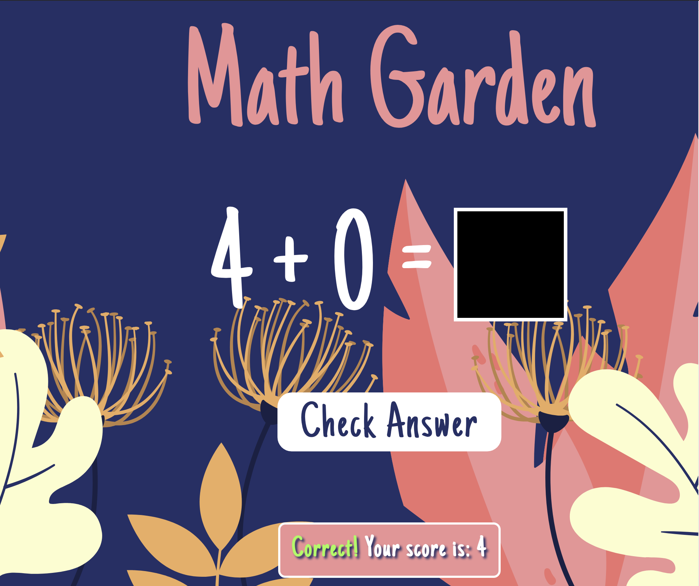

# Math Garden 

  ## Description

  A math game where the user draws their answer to a math problem on a canvas element.  A Tensorflow model, which has been trained on handwritten number samples, interprets the hand drawn number.  The user is given a conditionally rendered message as to whether the answer is correct.  For each correct answer, the "garden" grows.

  App screenshot:
  
  
  ## Table of Contents
  
  - [Installation](#installation)
  - [Usage](#usage)
  - [License](#license)
  - [Contributing](#contributing)
  - [Tests](#tests)
  - [Questions](#questions)
  
  ## Installation
  
  Deployed URL:  https://billstephens2022.github.io/math_garden/
  
  ## Usage
  Draw answer to the math problem in the black box.  Click "Check Answer" button.  With correct answers, watch the "garden" grow.
  
  N/A

  ## License
This application is covered under the MIT License.
 For more information: https://opensource.org/licenses/MIT
  
  ## Contributing
  N/A
  
  ## Tests
  N/A

  ## Questions
  Contact Info 
  GitHub user name: BillStephens2022 
  Link to GitHub profile: https://github.com/BillStephens2022 
  Email: stephensbill17@gmail.com